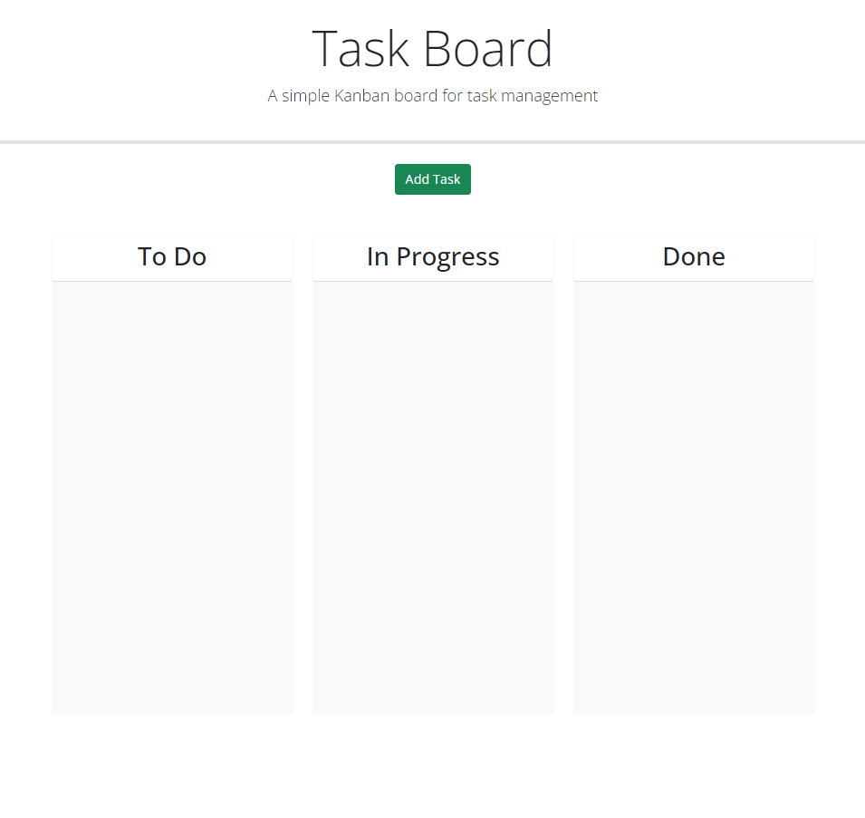
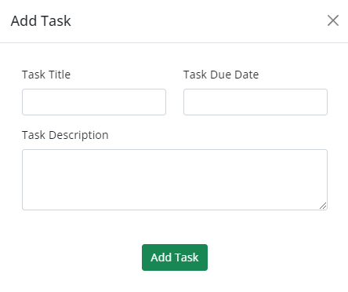
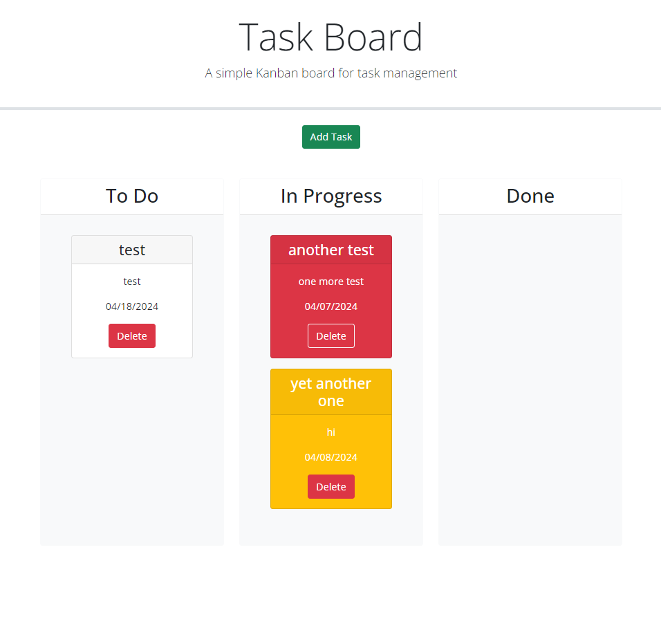
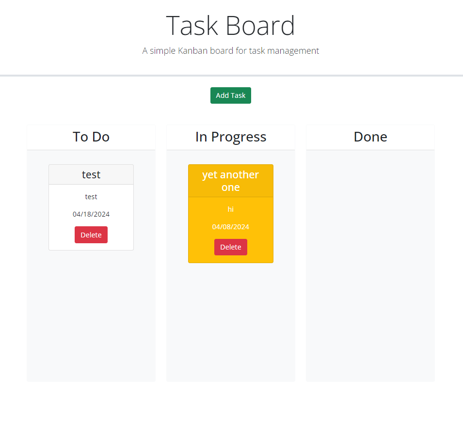

# Task-Planner
This link will take you to the Task-Planner: 

## Description

- For users to add, keep track of, and organize tasks whether they are pending, being worked on, or completed.

## Features

- Users can add new tasks using the ADD TASK button.

- Tasks can be moved between different stages of completion.

- Users can delete tasks they no longer need.

## Technologies

- Day.js
- jQuery UI
- JavaScript
- Bootstrap
- CSS3
- HTML5

## Usage

- Users can click the "Add Task" button and fill out the form to create a task.
- Tasks can be moved between different stages of completion by dragging and dropping them.
- Tasks with approaching due dates are highlighted based on their status.
- To delete a task, click the "Delete" button.

## License

- MIT License